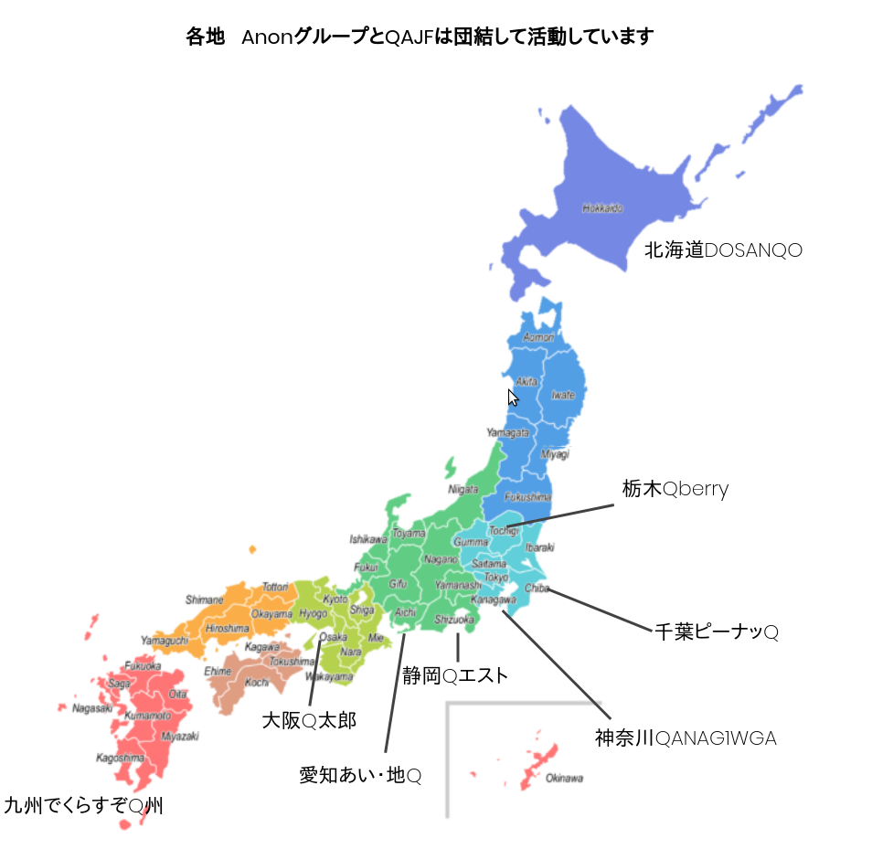

## QT meet upのご案内

名称が新しく変わりました。詳しくは<a href="/information.html">information</a>をご覧ください。

全国各地で、QAJF隊員とアノンさんが会って話し合うQT meet upが活発に開催されています。
疑問に思うことや世の中の事、隊員に聞きたいこと、話したいこと、なんでも構いません。
お時間のご都合がよければ、お気軽にぜひご参加をお願いします。

### 【QT meet upの目的と基本方針】

1) 各地のコミュニティでミーティングや親睦会、食事会などを設けること。

2) 各地域で誰(教育委員会、市議会、市長など)を支援すべきかを知ること。

3) 抗議活動を伴わない小規模な集会を催すことで、会うことへの恐怖を克服すること。

4) 地域の人々と知り合いになり、リーダーシップを発揮できるようになること。

### QT meet up 受付担当窓口

💁‍♀️参加希望の方は

下記を明記の上、参加希望開催地宛にメールにてお申込みください💞

​

⚫️参加ご希望のQT meet up

⚫️SNS(Twitter/gab等)アカウント名・ユーザー名

⚫️顔出しの可否(撮影、配信有り）

⚫️性別

​

を明記の上、SNS(Twitter/gab等)プロフィール画面のスクショを添付してメールにてお申込みください。

24時間以内にご返信がない場合は、

迷惑メール設定をご確認の上、解除後に再度ご連絡お願い致します。

​

※この他にもアンチ対策の為、こちらからお聞きする事があります。その際にはご協力いただけると助かります🙏✨

北海道： <a href="mailto:hokkaido.qajf@gmail.com" target="_self">hokkaido.qajf@gmail.com</a>

栃木 :  <a href="mailto:qajftochigi17@gmail.com" target="_self">qajftochigi17@gmail.com</a>

東京：  <a href="mailto:jgd.tokyo@gmail.com" target="_self">jgd.tokyo@gmail.com</a>

神奈川： <a href="mailto:qajf.kanagawa@gmail.com" target="_self">qajf.kanagawa@gmail.com</a>

千 葉： <a href="mailto:qajf.chiba@gmail.com" target="_self">qajf.chiba@gmail.com</a>

愛知・静 岡： <a href="mailto:qajf.sizuoka@gmail.com" target="_self">qajf.sizuoka@gmail.com</a>

大 阪： <a href="mailto:qajf.kinki@gmail.com" target="_self">qajf.kinki@gmail.com</a>

九 州： <a href="mailto:qajf.declasq@gmail.com" target="_self">qajf.declasq@gmail.com</a>

## QT meet up スケジュール

### 2022/04/28更新

5月

でくらすぞQ州 QT meet up

5月1日（日) 13時～16時 北九州市内 
&#128231; <a href="mailto:qajf.declasq@gmail.com" target="_self" style="color:#ddd;">qajf.declasq@gmail.com</a>
終了いたしました。

QANAG1WGA神奈川 QT meet up

5月14日（土) 13時～ 横浜市 &#128231; <a href="mailto:qajf.kanagawa@gmail.com" target="_self">qajf.kanagawa@gmail.com</a>
終了いたしました。

<strong>NEW</strong>

Qapital東京QTmeetup

5月21日（土) 13時～16時 中央区　&#128231; <a href="mailto:jgd.tokyo@gmail.com" target="_self">jgd.tokyo@gmail.com</a>

愛知あい・地Q  QTmeetup

5月29日（日) 13時～15時 名古屋市 千種区　&#128231; <a href="mailto:qajf.sizuoka@gmail.com" target="_self">qajf.sizuoka@gmail.com</a>

6月

<strong>NEW</strong>

北海道DOSANQO QT meet up

6月25日（土) 13時〜15時 札幌市　&#128231; <a href="mailto:hokkaido.qajf@gmail.com" target="_self">hokkaido.qajf@gmail.com</a>

## Q散歩のご案内

※事前の参加申し込み連絡は不要です

   各自 現地解散

 

Q散歩に参加しませんか🐸🍿

MEMEを持って街を散歩しましょう

 

興味のある方にはチラシをお渡しします

 

チラシやMEMEは、各自で無理ない範囲で持ってきて頂けると大変助かります

 

夕方には現地解散ですのでお食事会などは致しません🙏

 

宜しければ記念撮影に参加頂けると幸いです🙏✨

 

 

 

☔️※雨天の場合※

 

雨が降った場合は申し訳ありません 記念撮影のみ参加をお願い致します🙇‍♀️

散歩ができる程度の​雨量の場合は 状況を見ながら散歩を致します。

​

 

 

WWG1WGA

​

 

 

※誹謗中傷・悪口・愚痴・いちゃもん・嫌がらせをするような方のご参加はお断りさせて頂いております。過去には味方を装って参加し個人情報を抜き取った工作員もいました。初対面の方に心を許して自分のことを話しすぎないよう 参加者の皆さまは十分におきをつけてご参加ください。工作員はいい人のふりをして近づいてきます。
 
